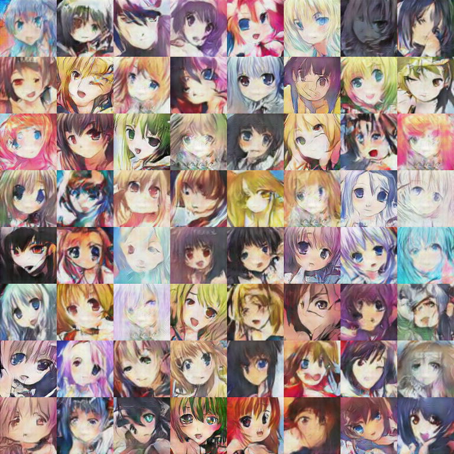
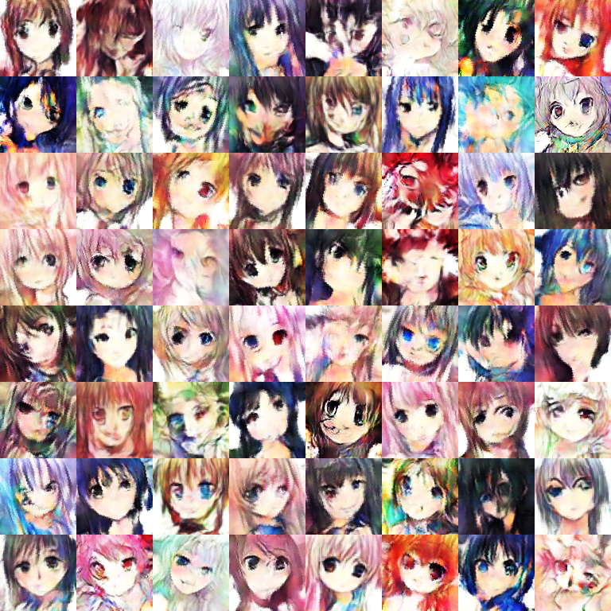
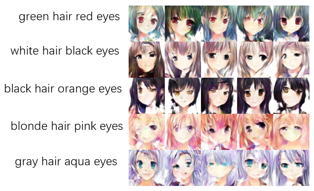

# Anime_GAN
This repository records my GAN models with Anime. 

# Dependencies
* [Python 3.6+](https://www.continuum.io/downloads)
* [PyTorch 0.4.0](http://pytorch.org/)
* [numpy 1.14.1, matplotlib 2.2.2, scipy 1.1.0](https://www.scipy.org/install.html)
* [imageio 2.3.0](https://pypi.org/project/imageio/)
* [tqdm 4.24.0](https://pypi.org/project/tqdm/)
* [keras 2.1.2](https://keras.io/#installation)(for WGAN_keras)
* [tensorflow 1.2.1](https://www.tensorflow.org/install/)(for WGAN_keras)
* cv2 -- `pip install opencv-python`(for ConditionalGAN)

# DCGAN
you need to download the [dataset](https://1drv.ms/u/s!AgBYzHhocQD4g0_Fr-mC-DYfWahJ) named **faces.zip**, then execute the first step——Cloning the repository, and extract and move it in `Anime_GAN/DCGAN/`.
## 1. Cloning the repository
```bash
$ git clone https://github.com/FangYang970206/Anime_GAN.git
$ cd Anime_GAN-master/DCGAN/
```
## 2. run the code
```bash
$ python main.py 
```
## 3. 500 epochs result

---
# WGAN
The WGAN implemented by pytorch has bugs. If anyone can find them, i will appreciate you so much! 
I implement a keras version Anime_WGAN. Like DCGAN, you should download the [dataset](https://1drv.ms/u/s!AgBYzHhocQD4g0_Fr-mC-DYfWahJ) named **faces.zip**(the same as DCGAN), then execute the first step——Cloning the repository, and extract and move it in `Anime_GAN/WGAN_keras/faces/`.
## 1. Cloning the repository
```bash
$ git clone https://github.com/FangYang970206/Anime_GAN.git
$ cd Anime_GAN/WGAN_keras/
```
## 2. run the code
```bash
$ python wgan_keras.py 
```
## 3. 100000 steps result

# ConditionalGAN
you need to download the [dataset](https://1drv.ms/u/s!AgBYzHhocQD4g3n4vJSQ9s6ZUZOQ) named **images.zip**, then execute the first step——Cloning the repository, and extract and move it in `Anime_GAN/ConditionalGAN/`.The tag.csv file is dataset label, include hair color and eye color.The test.txt is test label file used to generate test images.
## 1. Cloning the repository
```bash
$ git clone https://github.com/FangYang970206/Anime_GAN.git
$ cd Anime_GAN/ConditionalGAN/
```
## 2. run the code
Two mode: train or infer. In infer mode, make sure you have trained the ConditionalGAN.
```bash
$ python main.py --mode "train"
$ python main.py --mode "infer"  
```
## 3. 55000 steps result



# Reference
* [李宏毅GAN课程及PPT][1]
* [DCGAN paper][2]
* [chenyuntc][3]
* [JasonYao81000][4]
* [tjwei][5]


  [1]: http://speech.ee.ntu.edu.tw/~tlkagk/courses_MLDS18.html
  [2]: http://arxiv.org/abs/1511.06434
  [3]: https://github.com/chenyuntc/pytorch-GAN
  [4]: https://github.com/JasonYao81000/MLDS2018SPRING/tree/master/hw3
  [5]: https://github.com/tjwei/GANotebooks/blob/master/wgan2-keras.ipynb
  